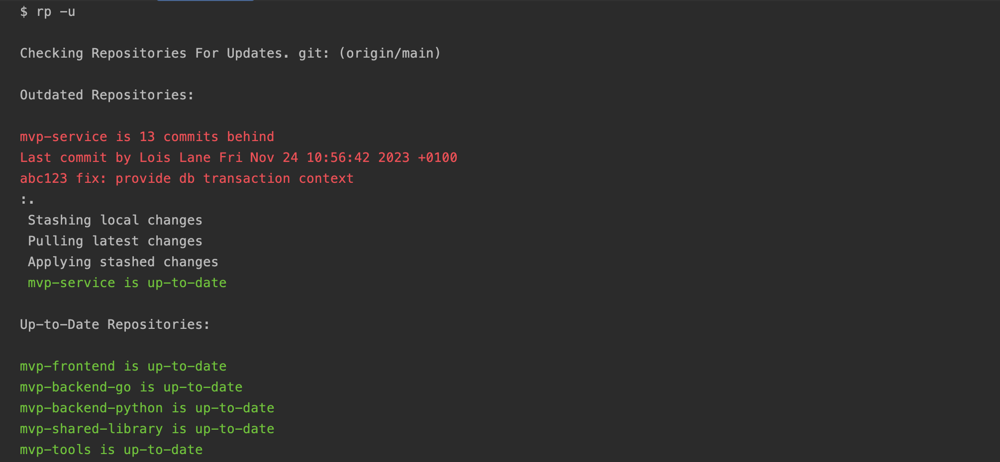

# reporter

Reporter recursively reports and resolves drifts across multiple git repositories.



## Installation
### Prerequisites
Ensure you have [Git](https://git-scm.com/downloads) and [Go](https://go.dev/dl/) 1.18 >= installed on your machine.

### Installing with go install
You can install the binary directly using `go install`. Follow these steps:

1. Set the environment variable for the Go path:

    ```sh
    export GOPATH=$(go env GOPATH)
    ```
2. Install the binary:

    ```sh
    go install github.com/devpies/reporter@latest
    ```

    This command will download the package, compile it, and place the binary in your `$GOPATH/bin`.


3. Ensure `$GOPATH/bin` is in your `$PATH`:

    ```sh
    export PATH=$PATH:$GOPATH/bin
    ```

    You can add this line to your shell configuration file (e.g., `~/.bashrc`, `~/.zshrc`) to make it persistent:
    
    ```sh
    echo 'export PATH=$PATH:$GOPATH/bin' >> ~/.bashrc
    echo 'alias rp=reporter' >> ~/.bashrc
    source ~/.bashrc
    ```

### Installing from Source

You can also install reporter by cloning the repository and building it from source. Follow these steps:

```sh
git clone https://github.com/devpies/reporter
cd reporter
go build -o rp reporter.go
sudo mv rp /usr/local/bin/rp
```

## Getting Started

### Checking Multiple Git Repositories

Run reporter in a parent directory that contains multiple Git repositories.

```
$ rp

Checking Repositories For Updates. git: (origin/main)

Outdated Repositories:

mvp-service is 13 commits behind
Last commit by Lois Lane Fri Nov 24 10:56:42 2023 +0100
abc123 fix: provide db transaction context

Up-to-Date Repositories:

mvp-frontend is up-to-date
mvp-backend-go is up-to-date
mvp-backend-python is up-to-date
mvp-shared-library is up-to-date
mvp-tools is up-to-date
```

### Updating Multiple Git Repositories

Automatically update repositories that are behind (--update, -u):

```
$ rp -u

Checking Repositories For Updates. git: (origin/main)

Outdated Repositories:

mvp-service is 13 commits behind
Last commit by Lois Lane Fri Nov 24 10:56:42 2023 +0100
abc123 fix: provide db transaction context
:.
 Stashing local changes
 Pulling latest changes
 Applying stashed changes
 mvp-service is up-to-date

Up-to-Date Repositories:

mvp-frontend is up-to-date
mvp-backend-go is up-to-date
mvp-backend-python is up-to-date
mvp-shared-library is up-to-date
mvp-tools is up-to-date
```

### Logging Latest Commits Before Pulling

Display the latest commits on the remote branch that are not yet present
in the local branch before pulling changes (--log, -l).

```
$ rp -l

commit 2743ff76bbdc4affba6b39a8866fd7ccb8db8190 (origin/main)
Merge: 915051a 2e0a935
Author: Lois Lane <lois@lane.io>
Date:   Fri Nov 24 10:56:42 2023 +0100

    Merge pull request #2 from clarkkent/auth_module
    Auth Module
    
commit 2e0a935a9817bdc39badefadce2365129f35fa17 (HEAD, origin/branch3, auth_module)
Author: Clark Kent <clark@kent.io>
Date:   Mon Dec 01 10:56:42 2023 +0100

    feat: add new authentication module
```

## Help

Display help text (--help, -h):

```
$ rp -h

Usage: rp (reporter) [OPTIONS]

Reporter recursively reports and resolves drifts across multiple git repositories.

Options:
--help, -h        Show this help message
--update, -u      Automatically update repositories that are behind
--branch, -b      Specify the branch to check (default: main)
--log, -l         Show the complete list of changes using git log
--force, -f       Forcefully abort rebase and merge conflicts to update
--remote, -r      Remote name (default: origin)

Examples:

[Truncated Output For Brevity]
...
```

## Configuration File (.rprc)

The `.rprc` file is an optional YAML configuration file that allows you to customize the behavior of the reporter tool.
It can configure the remote and branch to check for updates, whether to automatically update repositories that are behind,
and define which repositories to include or exclude from the check.

Place the `.rprc` file wherever you'd like to run reporter.

### Include/Exclude Repositories

You can specify which repositories to include or exclude in the `.rprc` file.

- **Include List:** If you specify an include list, only the repositories listed will be checked.
- **Exclude List:** If you specify an exclude list, the repositories listed will be ignored.
- **Combination:** If both lists are specified, the tool will check only the repositories listed in include and will
exclude any repositories that are also listed in exclude. The exclude list refines the include list by removing 
repositories that should not be checked.

Example `.rprc` File

```yaml
branch: main
update: true
include:
   - repo1
   - repo2
   - repo3
exclude:
   - repo3
remote_name: origin
```

## Contributing

To contribute, create an issue or pull request. Remember to use the project Makefile for common development tasks:

```
make install
make test
```


