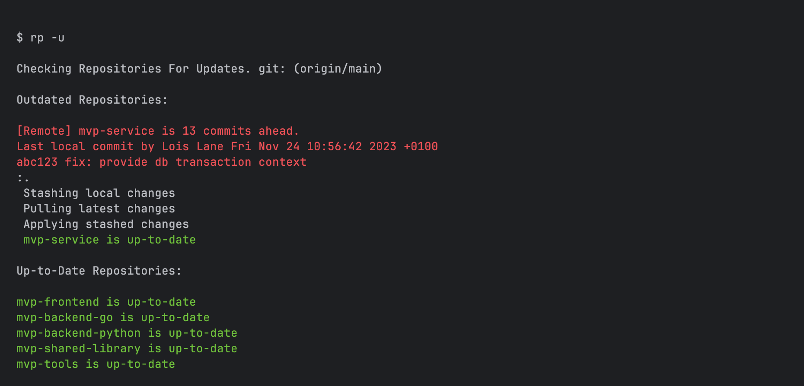

# reporter

Reporter recursively reports and resolves drifts across multiple git repositories.



## Overview

Reporter recursively detects and resolves drift across multiple Git repositories.
It ensures that local repositories remain synchronized with their remote counterparts, 
making it easier to manage large or multi-repo projects.

When run inside a Git repository, Reporter inspects only that repository.
When run in a non-repository directory, it recursively scans all subdirectories, identifies Git repositories, and 
reports their synchronization status relative to the desired remote branch.

Reporter categorizes repositories as up-to-date or outdated depending on whether the local branch is behind the remote. 
If a repository is behind and the `-u` or `--update` flag is provided, Reporter automatically pulls the latest changes.

If local modifications are present, Reporter safely stashes them before updating, pulls the remote changes, and then 
reapplies the stashed work to preserve developer progress.

## Help

Display help text (--help, -h):

```
$ rp -h

Usage: rp (reporter) [OPTIONS]

Reporter recursively reports and resolves drifts across multiple git repositories.

Options:
  --explain, -e     Show examples
  --help, -h        Show this help message
  --version, -v     Show version information
  --update, -u      Automatically update repositories that are behind
  --branch, -b      Specify the branch to check (default: main)
  --log, -l         Show the complete list of changes using git log
  --force, -f       Forcefully abort rebase and merge conflicts to update
  --remote, -r      Remote name (default: origin)

Config file (.rprc) also supports a 'branches' map to override the branch
checked per-repository, keyed by directory name:

  branches:
    repo1: release
    repo2: develop
```

## Releases

Prebuilt binaries for Linux, macOS, and Windows (amd64/arm64) are published on the
[GitHub Releases](https://github.com/devpies/reporter/releases) page for every `vX.Y.Z` tag. Download the archive for
your platform, and verify the build with:

```sh
rp --version
```

Maintainers cut a release by pushing a tag matching `v*`:

```sh
git tag v1.2.3
git push origin v1.2.3
```

This triggers the `Release` GitHub Actions workflow, which cross-builds `rp` for every supported platform and
publishes a GitHub Release with the binaries attached and auto-generated notes listing the changes since the
previous release.

## Installation
### Prerequisites
Ensure you have [Git](https://git-scm.com/downloads) and [Go](https://go.dev/dl/) 1.18 >= installed on your machine.

### Installing from Source

You can also install reporter by cloning the repository and building it from source. Follow these steps:

```sh
git clone https://github.com/devpies/reporter
cd reporter
go build -o rp .
sudo mv rp /usr/local/bin/rp
```

### Installing with go install
You can install the binary directly using `go install`. Follow these steps:

1. Set the environment variable for the Go path:

    ```sh
    export GOPATH=$(go env GOPATH)
    ```
2. Install the binary:

    ```sh
    go install github.com/devpies/reporter@latest
    ```

    This command will download the package, compile it, and place the binary in your `$GOPATH/bin`.


3. Ensure `$GOPATH/bin` is in your `$PATH`:

    ```sh
    export PATH=$PATH:$GOPATH/bin
    ```

    You can add this line to your shell configuration file (e.g., `~/.bashrc`, `~/.zshrc`) to make it persistent:
    
    ```sh
    echo 'export PATH=$PATH:$GOPATH/bin' >> ~/.bashrc
    echo 'alias rp=reporter' >> ~/.bashrc
    source ~/.bashrc
    ```

## Configuration File (.rprc)

The `.rprc` file is an optional YAML configuration file that allows you to customize the behavior of the reporter tool.
It can configure the remote and branch to check for updates, whether to automatically update repositories that are behind,
and define which repositories to include or exclude from the check.

Place the `.rprc` file wherever you'd like to run reporter.

> NOTE: When run in a git repository, `rp` will check both the current directory and its parent for configuration.

### Include/Exclude Repositories

You can specify which repositories to include or exclude in the `.rprc` file.

- **Include List:** If you specify an include list, only the repositories listed will be checked.
- **Exclude List:** If you specify an exclude list, the repositories listed will be ignored.
- **Combination:** If both lists are specified, the tool will check only the repositories listed in include and will
exclude any repositories that are also listed in exclude. The exclude list refines the include list by removing 
repositories that should not be checked.

Example `.rprc` File

```yaml
branch: main
update: true
include:
   - repo1
   - repo2
   - repo3
exclude:
   - repo3
remote_name: origin
```

### Per-Repository Branch Overrides

By default, every repository is checked against the same `branch`. If you need specific repositories to track a
different branch, add a `branches` map keyed by repository directory name.

- **Precedence:** A per-repo entry in `branches` overrides the global `branch` for that repository.
- **CLI override:** Explicitly passing `--branch`/`-b` on the command line takes precedence over both the global
`branch` and any `branches` entries, applying to every repository checked.

Example `.rprc` File

```yaml
branch: main
branches:
   repo1: release
   repo2: develop
```

In this example, `repo1` is checked against `release`, `repo2` against `develop`, and every other repository against
the global `main` branch.

## Contributing

To contribute, please create an issue or pull request. For common development tasks, utilize the project's Makefile.

```
make install
make test
make build
```

## License
This project is licensed under the MIT License. See the [LICENSE file](./LICENSE) for details.

